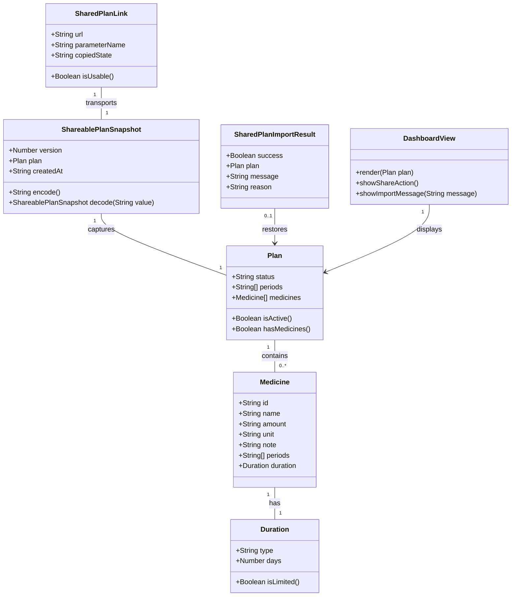

# Share Plan Link Generation

## Requirements
Implement portable snapshot sharing for locally stored medication plans so a customer can generate a link from the current active plan, open that link in another browser, device, session, or user instance, and see the same customer-visible plan settings without accounts, backend storage, database records, or live synchronization.

## Entities

Use the current plain object structures for `Plan`, `Medicine`, `Duration`, `draft`, and the active local plan. Do not introduce class wrappers or a framework. `ShareablePlanSnapshot`, `SharedPlanLink`, and `SharedPlanImportResult` describe the data flow and validation responsibilities to implement with small functions in the existing single-file app.

## Approach
1. Snapshot sharing workflow:
   - Add a customer-visible share action to the active dashboard because only an active plan represents a completed medication plan.
   - Generate links from the current saved plan, not from transient taken-card UI state.
   - Treat every generated link as a standalone snapshot; later plan edits, resets, or recreations require a newly generated link.

2. Static PWA implementation:
   - Keep the implementation inside `index.html` using existing DOM handlers, plain JavaScript functions, browser local storage, and current button/dialog styling.
   - Encode the complete active plan into one URL parameter or hash value that works on static hosting and installed PWA launches.
   - Parse the share value during initialization before deciding whether to render the local plan or home screen.
   - Preserve the existing service worker, manifest, no-build setup, and local-first product model.

3. Business logic:
   - Only allow sharing when there is a valid active plan with at least one medicine.
   - Restore a valid shared plan into the same dashboard flow used by locally created plans.
   - Never replace an existing local plan from an invalid or malformed share value.
   - If a valid shared plan is opened while another local plan exists, protect the existing plan through a confirmation or equally explicit customer choice before replacement.
   - Communicate that links contain plan details and represent snapshots, not live synchronized plans.

4. Customer feedback and failure handling:
   - Provide immediate feedback when a share link is generated or copied.
   - Show a clear message when a shared link cannot be opened.
   - Use existing alert/dialog patterns unless a small reusable status message is added consistently with current visual conventions.

## Structure

### Inheritance Relationships
1. No inheritance hierarchy is required; the app is a static single-file PWA using plain objects and functions.
2. Existing plan data structures remain backward compatible and are extended only through optional snapshot metadata when needed.
3. Share/import errors are represented as customer-facing result states or messages, not custom exception classes.

### Dependencies
1. Dashboard share action calls `generateShareLinkFromCurrentPlan()`.
2. `generateShareLinkFromCurrentPlan()` calls `loadPlan()`, `validateShareablePlan(plan)`, `encodePlanSnapshot(plan)`, and `presentShareLink(url)`.
3. App initialization calls `readSharedPlanFromUrl()` before normal local-plan rendering.
4. `readSharedPlanFromUrl()` calls `decodePlanSnapshot(value)` and `validateImportedPlan(plan)`.
5. Successful import calls `savePlan(plan)`, `buildDashboard(plan)`, and `showScreen('dashboard')`.
6. Failed import calls a customer-facing message function and continues without overwriting existing local storage.

### Layered Architecture
1. UI Layer: Dashboard footer buttons, dialogs or messages, copy/share feedback, and import error messaging in `index.html`.
2. State Layer: Existing `loadPlan()` and `savePlan(plan)` functions continue to own browser-local persistence.
3. Share Serialization Layer: Small functions encode, decode, and validate share snapshots without changing the core plan model.
4. Routing/Initialization Layer: Existing startup flow checks for shared-plan URL data before falling back to the locally stored active plan or home screen.
5. Error Handling Layer: Plain JavaScript guard clauses and user-facing messages handle invalid plans, malformed links, unavailable clipboard APIs, and existing-plan replacement decisions.

## Operations

### Update Markup - Dashboard Share Controls
1. Responsibility: Provide a customer action to generate and use a share link from the active dashboard.
2. Elements:
   - Add a secondary or outline button in `.dash-footer` labeled `Share plan` or similarly clear wording.
   - Keep the existing `Reset plan` action available and visually distinct from sharing.
   - Add a lightweight message region or dialog content for share link success, copy fallback, snapshot explanation, and import failures.
3. Behavior:
   - The share button calls `handleSharePlan()`.
   - The share UI explains that the link is a snapshot and that changing the plan later requires generating a new link.
4. Constraints:
   - Do not add a landing page or new route.
   - Do not require account creation, network requests, or backend setup.
   - The button must only be useful when an active plan is displayed.

### Implement Share Serialization Functions
1. Responsibility: Convert the active plan into a URL-safe snapshot and recover it when a shared URL is opened.
2. Functions:
   - `createShareSnapshot(plan): Object`
     - Return an object containing a version number, creation timestamp, and the plan data needed to restore the visible dashboard.
     - Exclude session-only taken card state.
   - `encodePlanSnapshot(plan): String`
     - Validate that the plan is active and contains at least one medicine.
     - Serialize the snapshot and encode it into a URL-safe string.
     - Throw or return a failure state for invalid shareable plans.
   - `decodePlanSnapshot(value): Object|null`
     - Decode the URL value into a snapshot object.
     - Return `null` for malformed, missing, or unsupported data.
   - `extractPlanFromSnapshot(snapshot): Object|null`
     - Verify the snapshot version and return a plan that matches the existing active plan shape.
3. Logic:
   - Preserve medicine names, amount, unit, note, periods, and duration.
   - Preserve selected plan periods in their existing order.
   - Preserve medicine IDs if present, or normalize safely if missing from older snapshots.
   - Reject snapshots that do not contain a usable plan object.
4. Constraints:
   - Do not refactor `Medicine`, `Duration`, or `Plan` into classes.
   - Do not encode hidden implementation state that is not part of the customer-visible plan.

### Implement Plan Validation Functions
1. Responsibility: Ensure generated and imported plans are safe to share, save, and render.
2. Functions:
   - `validateShareablePlan(plan): { valid: Boolean, message: String }`
     - Valid only when `plan.status === 'active'`.
     - Valid only when `plan.periods` is a non-empty array.
     - Valid only when `plan.medicines` is a non-empty array.
   - `validateImportedPlan(plan): { valid: Boolean, message: String }`
     - Verify status, periods, medicines, medicine period references, and duration shape.
     - Verify each medicine has a non-empty name and at least one valid period.
     - Verify limited durations have a positive day count.
3. Logic:
   - Accept only known periods: `morning`, `afternoon`, and `evening`.
   - Keep optional fields optional: amount, unit, and note may be empty strings.
   - Return customer-safe messages for failures.
4. Constraints:
   - Invalid imported data must not be passed to `savePlan(plan)` or `buildDashboard(plan)`.
   - Validation must tolerate older snapshots only when the resulting plan can still render correctly.

### Implement Share Link Generation Flow
1. Responsibility: Generate a full URL that another browser, device, session, or user can open.
2. Function:
   - `handleSharePlan(): void`
     - Load the active local plan.
     - Validate share eligibility.
     - Encode the snapshot.
     - Build a URL based on the current page location plus the share parameter.
     - Try to copy the URL to the clipboard when supported.
     - Show success feedback with the link or a copy fallback.
3. Logic:
   - If no shareable active plan exists, show a clear message such as `Create a plan with at least one medicine before sharing.`
   - If copying succeeds, tell the customer the link was copied and is a snapshot.
   - If copying is unavailable or fails, show the link in a selectable field or dialog so the customer can copy it manually.
4. Constraints:
   - Do not make network calls.
   - Do not mutate the current plan while generating a link.
   - Generated links must always reflect the plan state at the time `handleSharePlan()` runs.

### Implement Shared Link Import Flow
1. Responsibility: Open a shared plan URL and restore the captured plan without corrupting local data.
2. Functions:
   - `readSharedPlanFromUrl(): SharedPlanImportResult`
     - Detect the configured share parameter or hash value.
     - Decode and validate the snapshot.
     - Return a success result with the restored plan or a failure result with a message.
   - `handleSharedPlanOnInit(): Boolean`
     - Run during app startup before normal local-plan rendering.
     - If no shared-plan data exists, return `false` and allow normal startup.
     - If the shared data is invalid, show an error message and return `false` without changing local storage.
     - If valid and no active local plan exists, save and render the imported plan and return `true`.
     - If valid and an active local plan exists, ask the customer to confirm replacing it or provide a clear choice to keep the local plan.
3. Logic:
   - On successful import, save the imported plan through `savePlan(plan)` and render with `buildDashboard(plan)`.
   - Keep the normal dashboard behavior after import, including auto-selected period tab.
   - Avoid keeping broken shared URL data active after the result has been handled if it would repeatedly show the same failure.
4. Constraints:
   - Invalid links must not overwrite local storage.
   - Existing local plans must not be silently replaced.
   - The receiving flow must work in another browser, device, session, or user instance that has no local plan.

### Update Initialization Flow
1. Responsibility: Integrate shared-plan opening with the existing app startup sequence.
2. Current flow:
   - Load local plan.
   - If active, render dashboard.
   - Otherwise show home.
3. New flow:
   - First call `handleSharedPlanOnInit()`.
   - If it returns `true`, stop startup because the shared plan has been handled.
   - Otherwise continue with the existing local plan or home screen behavior.
4. Constraints:
   - Preserve service worker registration.
   - Preserve existing visibility-change behavior for active plans.
   - Preserve current no-backend, no-build deployment model.

### Add Customer-Facing Messaging
1. Responsibility: Make share and import outcomes understandable.
2. Messages:
   - Share success: `Share link copied. It includes this plan as it is now.`
   - Manual copy fallback: `Copy this link to share the current plan.`
   - Snapshot reminder: `If you change the plan later, generate a new link.`
   - Empty/ineligible plan: `Create a plan with at least one medicine before sharing.`
   - Invalid import: `This shared plan link could not be opened.`
   - Existing-plan confirmation: `Opening this shared plan will replace the plan saved on this device.`
3. Constraints:
   - Messages must not expose internal parse errors, encoded payloads, or stack traces.
   - Keep visual style consistent with current buttons, overlay, and dialog patterns.

### Manual Verification Tasks
1. Generate a plan with morning and evening periods, `Amoxicillin 500 mg`, limited duration `7 days`, and note `take after food`; generate a link; open it in a fresh browser/session; verify all visible settings match.
2. Generate a link, change or recreate the local plan with duration `10 days`, then open the old link in another session; verify the old link still shows `7 days`.
3. Generate a new link after adding `Ibuprofen 200 mg`; verify the new link restores both medicines.
4. Attempt to share with no active plan or no medicines; verify clear customer-facing failure behavior.
5. Open malformed, truncated, and unsupported shared links; verify no existing local plan is overwritten.
6. Open a valid shared link where a local plan already exists; verify the customer gets an explicit choice before replacement.
7. Test normal browser tab, incognito/private session, and installed PWA launch where possible.

## Norms
1. Plain JavaScript only:
   - Keep all behavior in `index.html` unless the project structure is intentionally changed later.
   - Do not add a framework, bundler, dependency, backend service, or database.
   - Prefer small named functions near the existing state, routing, dashboard, reset, and init sections.

2. Existing data structure preservation:
   - Keep the current active plan shape compatible with existing `loadPlan()`, `savePlan(plan)`, and `buildDashboard(plan)` usage.
   - Add snapshot wrapper metadata around the plan for sharing instead of changing the plan into a new class hierarchy.
   - Keep existing `periods` and `medicines` arrays as plain arrays.

3. Error handling:
   - Use guard clauses and result objects for expected customer-facing failures.
   - Do not throw uncaught exceptions during initialization or shared-link parsing.
   - Do not show raw exception messages, encoded data, or debugging details to customers.
   - Since this is not a backend app, do not create `GlobalExceptionHandler`, exception DTOs, or server response classes.

4. DOM and UI conventions:
   - Reuse `.btn`, `.btn-primary`, `.btn-secondary`, `.btn-danger`, `.btn-outline-accent`, `.overlay`, `.dialog`, and `.dash-footer` patterns.
   - Keep controls touch-friendly and readable on the existing narrow mobile layout.
   - Keep the share action visually secondary to core plan viewing and distinct from reset.

5. Validation standards:
   - Validate before sharing, before saving imported plans, and before rendering imported plans.
   - Validate business values using current known periods and duration rules.
   - Treat optional medicine fields as optional but preserve them exactly when present.

6. Documentation and comments:
   - Add short section comments only where they clarify the new share/import areas.
   - Avoid verbose comments that restate obvious DOM operations.
   - Keep customer-facing text concise and plain.

## Safeguards
1. Functional Constraints:
   - A share link must restore `status`, plan periods, medicine names, amounts, units, notes, medicine period selections, and duration settings.
   - A share link must represent a snapshot; later local changes must not alter previously generated links.
   - Sharing must be available only for a valid active plan with at least one medicine.
   - Opening a valid link in a fresh browser/session must render the dashboard without requiring account login or backend access.

2. Performance Constraints:
   - Share generation and import should complete within a normal tap-to-feedback interaction for typical plans of 1-20 medicines.
   - If the encoded URL would exceed a practical length threshold, the customer must receive a clear failure message instead of a broken link.
   - Dashboard rendering after import must remain immediate for typical personal medication schedules.

3. Security and Privacy Constraints:
   - Do not send medicine details to any backend, analytics endpoint, or external service.
   - Make clear that anyone with the link can open the encoded plan details.
   - Do not include session-only taken-card state in shared links.
   - Do not expose internal error details when a link fails to decode or validate.

4. Integration Constraints:
   - The feature must work on static hosting with no server route configuration.
   - The feature must remain compatible with the existing manifest and service worker setup.
   - The feature must not break normal app startup when no shared-plan URL data is present.
   - The feature must not require changes to Netlify deployment steps.

5. Business Rule Constraints:
   - Only `morning`, `afternoon`, and `evening` are valid period values.
   - A medicine must have a non-empty name and at least one valid period.
   - A limited duration must have a positive day count.
   - A shared import must produce an active plan before it can be saved and displayed.
   - Existing local plans must not be silently replaced by shared-link imports.

6. Exception Handling Constraints:
   - Invalid shared links must produce a customer-safe message and leave local storage unchanged.
   - Clipboard failures must produce a manual copy fallback.
   - Parsing failures must not prevent the app from loading normally.
   - All expected failure paths must be handled locally with UI feedback; no server exception handling applies.

7. Technical Constraints:
   - Do not add dependencies or build tooling.
   - Do not refactor the app into multiple modules as part of this feature.
   - Do not change the local storage key unless a backward compatibility plan is included.
   - Do not store shared snapshots anywhere except the URL and the receiving browser's normal local plan storage after successful import.

8. Data Constraints:
   - Encoded data must be URL-safe.
   - Imported data must be validated before persistence.
   - Unknown snapshot versions must be rejected or handled through a clearly defined compatibility path.
   - Customer-entered text with spaces, punctuation, accents, or emoji must survive sharing and importing.

9. Acceptance Criteria Constraints:
   - AC1 passes only when a customer can generate/copy/use a link from the current active plan without account or backend involvement.
   - AC2 passes only when another browser/device/session/user instance restores all visible plan settings from the link.
   - AC3 passes only when an old link remains unchanged after later local edits.
   - AC4 passes only when generating a new link after changes includes the updated plan contents.
   - AC5 passes only when empty/incomplete plans cannot be mistaken for complete shared plans.
   - AC6 passes only when invalid links do not replace or corrupt existing local data and show a clear failure message.
