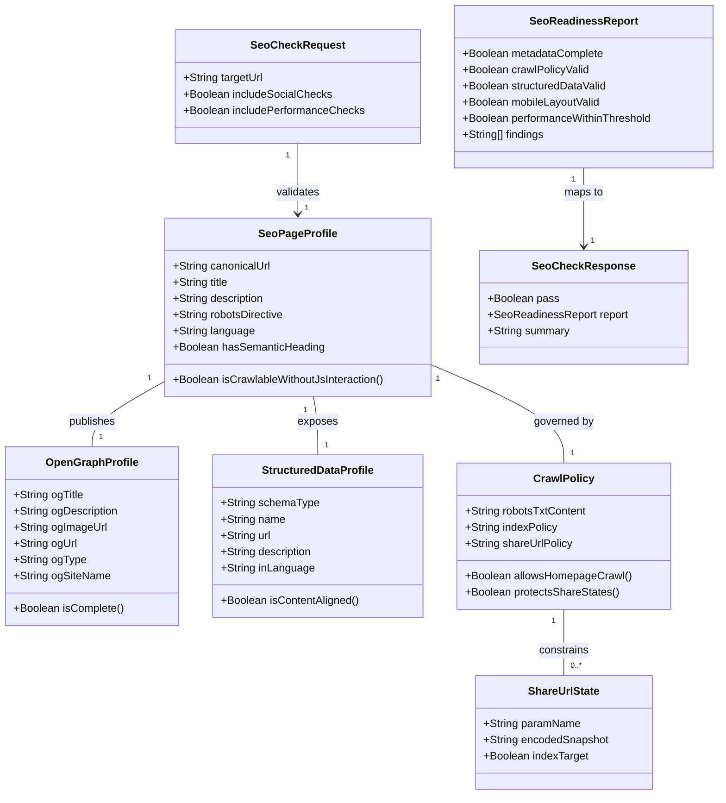

# SEO Website Optimization

## Requirements
Implement homepage-first SEO and social discoverability for the static MedPlan PWA so search and sharing surfaces consistently represent the product at https://med-plan.uk, while preventing shared plan URL states from becoming indexed landing pages.

## Entities

Use existing static assets and plain object patterns. Do not introduce framework entities or backend models. The entities above describe configuration and validation responsibilities, implemented through markup, static files, and lightweight validation scripts/documented checks.

## Approach
1. Homepage metadata and social signal consolidation:
   - Centralize all search and social metadata in the homepage head so crawlers and social parsers receive complete, consistent signals.
   - Align canonical and Open Graph URL fields to https://med-plan.uk.
   - Keep page copy, title, and meta description semantically aligned to avoid misleading snippets.

2. Crawl and indexing boundary control:
   - Add explicit crawl directives through robots policy for homepage discovery.
   - Prevent share-state URL patterns from being treated as intentional index targets.
   - Preserve the existing single-entry SPA behavior while making crawl intent unambiguous.

3. Structured data and semantic markup readiness:
   - Add website-level JSON-LD that reflects visible homepage messaging.
   - Maintain heading hierarchy and meaningful alternative text for any informative image content.
   - Keep structured data scope homepage-focused, not share-link focused.

4. SEO quality and release safety:
   - Introduce a repeatable SEO readiness check flow for metadata completeness, crawl directives, structured data, and mobile/CWV expectations.
   - Use existing project constraints (static hosting, PWA, no backend) as non-negotiable boundaries.
   - Ensure updates do not regress discoverability across search and social consumers.

## Structure

### Inheritance Relationships
1. No inheritance hierarchy is required; this is a static frontend project using HTML, JS, JSON, and text assets.
2. Existing app data models in js/app.js and js/core.js remain unchanged for SEO scope.
3. SEO concerns are represented as static configuration and validation artifacts, not runtime class hierarchies.

### Dependencies
1. index.html head metadata depends on final production domain policy and approved product messaging.
2. Open Graph tags depend on a stable social preview image asset and canonical homepage URL.
3. JSON-LD block depends on homepage name/description values and must mirror visible content.
4. robots.txt policy depends on indexing boundary decisions, including treatment of share-state URLs.
5. SEO readiness checks depend on deployed or local preview HTML output and measurable page quality signals.

### Layered Architecture
1. Presentation Layer: Homepage markup and semantic structure in index.html.
2. Metadata Layer: Meta tags, canonical, OG tags, and JSON-LD in index.html.
3. Crawl Policy Layer: robots.txt directives for crawler behavior.
4. Static Asset Layer: Manifest, icons, and OG image asset used by social parsers.
5. Validation Layer: Repeatable SEO checks documented in workflow/tests to gate release readiness.

## Operations

### Update Homepage Metadata - index.html head
1. Responsibility: Provide complete search and social metadata aligned to homepage purpose.
2. Attributes:
   - title: String - Clear product title for search and browser context.
   - description: String - Compelling statement under 160 characters.
   - canonicalUrl: String - https://med-plan.uk.
   - robotsDirective: String - Crawl/index rule for homepage.
3. Methods:
   - applyHeadMetadata(): void
     - Logic:
       - Set or update title, description, robots, canonical tags.
       - Ensure language and charset/viewport remain valid.
       - Prevent duplicate conflicting tags.
4. Annotations: Not applicable for static HTML.
5. Constraints:
   - Canonical must point to https://med-plan.uk.
   - Description must remain business-accurate and concise.

### Add Open Graph Signals - index.html head
1. Responsibility: Ensure shared links render complete social preview cards.
2. Attributes:
   - og:title: String
   - og:description: String
   - og:image: String (1200x630 target)
   - og:url: String (https://med-plan.uk)
   - og:type: String (website)
   - og:site_name: String (MedPlan)
3. Methods:
   - applyOpenGraphMetadata(): void
     - Logic:
       - Add missing OG tags.
       - Keep OG values consistent with standard metadata.
       - Reference a stable image path suitable for public crawl.
4. Constraints:
   - OG URL must not use preview/staging hostname.
   - OG values must align with visible homepage value proposition.

### Add Structured Data - JSON-LD in index.html
1. Responsibility: Expose machine-readable website context for crawlers.
2. Attributes:
   - @context: String
   - @type: String (WebSite)
   - name: String
   - url: String
   - description: String
   - inLanguage: String
3. Methods:
   - publishStructuredDataProfile(): void
     - Logic:
       - Insert a single JSON-LD script block.
       - Keep fields aligned with title/description and homepage copy.
       - Validate JSON syntax and field completeness.
4. Constraints:
   - Do not model share-state URLs as indexable entities.
   - Keep schema scope at homepage/site level.

### Create Crawl Directives - robots.txt
1. Responsibility: Define explicit crawler behavior for public vs share-state URL intentions.
2. Attributes:
   - userAgentRules: String
   - allowRules: String
   - disallowRules: String
   - sitemapHint: String (optional)
3. Methods:
   - defineRobotsPolicy(): void
     - Logic:
       - Permit crawling of the public homepage.
       - Document policy for non-public/share-state URL patterns.
       - Keep file simple, standards-compliant, and host-ready.
4. Constraints:
   - robots policy must not block homepage indexing by mistake.
   - Policy must align with no-index-target stance for shared plan states.

### Preserve Semantic and Accessibility Signals - index.html body
1. Responsibility: Maintain crawler-readable structure and inclusive content semantics.
2. Attributes:
   - primaryHeading: String
   - headingOrder: String[]
   - imageAltTextCoverage: Boolean
3. Methods:
   - validateSemanticStructure(): SeoCheckResponse
     - Logic:
       - Verify one clear h1 and logical section hierarchy.
       - Ensure informative images include meaningful alt text.
       - Flag regressions that reduce content clarity.
4. Constraints:
   - Do not introduce heading order regressions during copy updates.
   - Alternative text must describe purpose, not decorative noise.

### Define SEO Readiness Checks - release workflow
1. Responsibility: Gate releases on SEO baseline correctness.
2. Interface Definition:
   - runSeoReadinessChecks(request: SeoCheckRequest): SeoCheckResponse
3. Core Methods:
   - checkMetadataCompleteness(): Boolean
     - Input Validation: target URL resolves and returns homepage HTML.
     - Business Logic: verify required title/meta/robots/canonical/OG fields.
     - Exception Handling: return structured findings, no silent pass.
     - Return Value: pass/fail and missing field list.
   - checkCrawlPolicy(): Boolean
     - Input Validation: robots.txt is reachable.
     - Business Logic: evaluate homepage allow behavior and share-state policy intent.
     - Exception Handling: fail with actionable reason if robots file absent/invalid.
     - Return Value: pass/fail and policy notes.
   - checkStructuredData(): Boolean
     - Input Validation: JSON-LD is parseable.
     - Business Logic: verify website-level field presence and content alignment.
     - Exception Handling: report parse/field mismatch findings.
     - Return Value: pass/fail and schema findings.
   - checkMobileAndVitalsReadiness(): Boolean
     - Input Validation: common mobile viewport checks and performance measurement profile available.
     - Business Logic: evaluate 360x640 and 390x844 usability; confirm targets for LCP <= 2.5s, CLS <= 0.1, INP <= 200ms.
     - Exception Handling: return metric/context notes when partial.
     - Return Value: pass/fail and measured observations.
4. Dependency Injection: Not applicable in static app; use script/tooling checks and documented manual runbook.
5. Transaction Management: Not applicable.

### Update Supporting Static Assets
1. Responsibility: Ensure social preview asset and related static files are discoverable and stable.
2. Attributes:
   - ogImageAsset: String
   - imageDimensions: String
   - cacheStability: Boolean
3. Methods:
   - provisionOgImageAsset(): void
     - Logic:
       - Add or confirm a 1200x630 asset path.
       - Ensure asset can be fetched publicly.
       - Keep naming and placement stable across releases.
4. Constraints:
   - Avoid frequent path churn that causes stale social cache mismatches.

### Document SEO Policy and Validation Steps
1. Responsibility: Create clear team guidance for consistent SEO behavior.
2. Attributes:
   - policyDocument: String
   - checklistItems: String[]
   - releaseGateDefinition: String
3. Methods:
   - publishSeoChecklist(): void
     - Logic:
       - Capture required tags, robots policy, structured data requirements, and mobile/CWV checks.
       - Include explicit production domain rule: https://med-plan.uk.
       - Include verification steps before each deploy.
4. Constraints:
   - Documentation must be concise, testable, and maintained with changes.

## Norms
1. Static-first implementation:
   - Keep SEO changes in static artifacts: index.html, robots.txt, manifest/static assets, and project docs.
   - Do not introduce backend, SSR framework, or routing overhaul.

2. Metadata consistency:
   - Maintain one authoritative title/description intent across standard meta tags, OG fields, and JSON-LD.
   - Keep canonical and OG URL fields pinned to https://med-plan.uk for production.

3. Minimal structural disruption:
   - Preserve existing homepage flow and application logic in js/app.js and js/core.js.
   - Avoid unnecessary refactors to plan-sharing logic while implementing SEO scope.

4. Validation discipline:
   - Every release must include metadata, crawl policy, structured data, and mobile/CWV checks.
   - Treat missing required SEO artifacts as release blockers.

5. Content and semantics standards:
   - Keep one clear primary heading and logical heading progression.
   - Provide meaningful alt text for informative images.

6. PWA compatibility:
   - Ensure service worker, manifest, and static hosting behavior continue to function after SEO updates.
   - Avoid caching side effects that hide metadata updates during verification.

## Safeguards
1. Functional Constraints:
   - Homepage must include complete meta description, robots directive, canonical URL, and OG fields.
   - Canonical and OG URL values for production must be https://med-plan.uk.
   - Homepage content must remain crawlable without requiring user interaction.

2. Performance Constraints:
   - Homepage should satisfy readiness thresholds: LCP <= 2.5s, CLS <= 0.1, INP <= 200ms under defined mobile profile.
   - Added SEO assets must not introduce significant rendering regressions.

3. Security and Privacy Constraints:
   - Do not expose private plan details through SEO metadata or structured data.
   - Do not position share-state URLs as searchable landing pages.

4. Integration Constraints:
   - robots.txt must exist and be compatible with static hosting deployment.
   - Structured data and metadata must validate in production without server-side dependencies.
   - SEO updates must remain compatible with service worker behavior.

5. Business Rule Constraints:
   - Homepage is the primary index target.
   - Shared plan URL states are non-target indexing surfaces.
   - Search/social snippets must match visible product purpose and claims.

6. Exception Handling Constraints:
   - Missing metadata, invalid JSON-LD, or absent robots.txt must produce explicit validation failures.
   - Validation outcomes must provide actionable findings, not silent fallback assumptions.

7. Technical Constraints:
   - Keep architecture as static frontend PWA with no backend introduction.
   - Prefer additive metadata and policy changes over structural rewrites.

8. Data Constraints:
   - Description length target remains <= 160 characters for search snippet usability.
   - OG image target remains 1200x630 with stable public path.

9. API and Contract Constraints:
   - Public SEO contract for crawlers includes canonical URL, robots policy, OG tags, and website JSON-LD.
   - Release checks must validate contract presence and consistency each deployment.