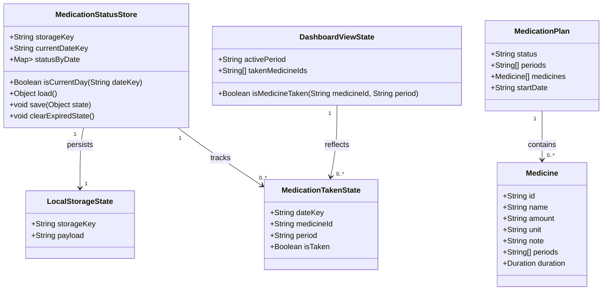

# Daily Medication Taken Status Persistence

## Requirements
Implement lightweight, day-based persistence for medicine taken status in the existing local-only MedPlan frontend so users can mark a medicine as taken and keep that state across new browser sessions on the same device until the day changes.

## Entities

Use the existing plain-object plan model in the app, and keep the implementation localized to the frontend. Do not introduce a backend, database, or framework-specific state manager.

## Approach
1. Local-first state management:
   - Add a small persistence layer around the existing localStorage-based app state.
   - Store a single current-day record that tracks which medicine/period combinations are marked as taken.
   - Reset or replace the saved state automatically when the day changes.

2. UI state integration:
   - Reuse the current dashboard card rendering in js/app.js.
   - Bind the taken-state toggle to the existing medicine card interaction so the user can mark and unmark medicines directly from the dashboard.
   - Preserve the current visual structure while reflecting the taken state in a clear, accessible way.

3. Lightweight storage strategy:
   - Keep only one record for the current day rather than accumulating historical entries.
   - Use a compact storage format with a day key and a list of taken identifiers.
   - Remove stale state on load when the stored date differs from the current date.

4. Robustness and safety:
   - Avoid breaking the current share-plan and reset flows.
   - Ensure toggling works even after reloads, navigation, or opening the app again in a new session on the same device.
   - If the stored state is malformed, ignore it and start with a clean current-day state.

## Structure

### Inheritance Relationships
1. No inheritance hierarchy is required; this is a small frontend enhancement in the existing vanilla JavaScript app.
2. The current plan model and dashboard rendering logic remain the primary structures to extend.
3. Any new helper functions should be plain functions, not class-based abstractions.

### Dependencies
1. js/app.js depends on the existing plan data structure and dashboard card rendering.
2. localStorage is already used for plan persistence, so the new status persistence should integrate with the same storage pattern.
3. The dashboard UI depends on medicine cards and period-based rendering in index.html.
4. The implementation must preserve the current no-backend constraint and not change the existing share-link behavior.

### Layered Architecture
1. Presentation Layer: Dashboard medicine cards in the browser UI.
2. State Layer: Small helper functions for loading, saving, toggling, and resetting daily taken status.
3. Storage Layer: localStorage key/value persistence with a single current-day entry.
4. Integration Layer: Dashboard rendering and event handling in js/app.js.

## Operations

### Add Daily Status Storage Helpers - js/app.js
1. Responsibility: Manage lightweight persistence of taken medicine status for the current day.
2. Attributes:
   - storageKey: String - Key used for the daily status record in localStorage.
   - todayKey: String - Date key matching the current calendar day.
   - takenItems: Array<String> - Identifiers for medicines marked as taken for the active day.
3. Methods:
   - getTodayKey(): String
     - Logic:
       - Create a stable date key using the local calendar date, for example YYYY-MM-DD.
   - loadTakenStatus(): Object
     - Logic:
       - Read the persisted status entry from localStorage.
       - Return an empty structure when nothing exists.
       - If the stored date does not match today, discard it and return a fresh state.
   - saveTakenStatus(state): void
     - Logic:
       - Store only the current day’s data.
       - Replace prior day data with the new state.
   - toggleTakenStatus(medicineId, period): Object
     - Logic:
       - Determine whether the given medicine/period combination is already marked as taken.
       - Add or remove the identifier from the current-day state.
       - Persist the updated state.
       - Return the updated state for the caller.
4. Annotations: None required for plain JavaScript functions.
5. Constraints:
   - Only current-day data may be kept.
   - The storage entry must remain small and not accumulate historical records.

### Integrate Taken-State Rendering - dashboard cards
1. Responsibility: Show whether each medicine is already marked as taken for the current day and period.
2. Attributes:
   - medicineId: String
   - period: String
   - isTaken: Boolean
3. Methods:
   - renderDashboardCards(plan): void
     - Logic:
       - For each medicine card, determine whether it is taken for the visible period and current day.
       - Apply a clear visual state such as a taken class or disabled/selected styling.
       - Keep the rendering consistent with the existing card layout.
4. Constraints:
   - The current day must be evaluated using the same date key as the persistence layer.
   - The visual state must not break the existing card structure.

### Enable Toggle Interaction - medicine card click handling
1. Responsibility: Let the user mark or unmark a medicine as taken directly from the dashboard.
2. Attributes:
   - medicineId: String
   - activePeriod: String
3. Methods:
   - handleMedicineTakenToggle(medicineId, period): void
     - Logic:
       - Read the current taken-state record.
       - Toggle the status for the medicine and active period.
       - Save the updated state.
       - Re-render the affected dashboard section so the changed state is immediately visible.
4. Constraints:
   - The action must work after reloads and new sessions on the same device.
   - The toggle must be scoped to the medicine and the current period, not globally across all periods.

### Preserve Existing Plan and Reset Behavior
1. Responsibility: Ensure the new daily status feature does not interfere with the existing plan creation, share-link, and reset flows.
2. Methods:
   - confirmReset(): void
     - Logic:
       - Reset the plan and the daily status state together when the user confirms reset.
   - handleSharedPlanOnInit(): void
     - Logic:
       - Continue to load the shared plan as before without affecting the daily taken-state persistence.
3. Constraints:
   - The new feature must be additive and non-destructive to the current plan data.
   - Any invalid or missing stored status should degrade gracefully to an empty state.

## Norms
1. Use plain JavaScript functions and existing DOM patterns already used in js/app.js.
2. Keep the storage format compact and easy to reason about.
3. Prefer small, focused helpers over large inline logic blocks.
4. Preserve the existing user-facing behavior and wording wherever possible.
5. Handle missing, malformed, or outdated storage values gracefully.
6. Keep the implementation accessible and easy to test by using clear state names and predictable DOM updates.

## Safeguards
1. Functional Constraints:
   - The feature must support marking a medicine as taken and unmarking it again.
   - The state must persist across page refreshes and new sessions on the same device for the current day.
   - The state must reset automatically when the calendar day changes.
2. Performance Constraints:
   - Storage usage must remain bounded to a single current-day record.
   - Re-rendering after a toggle must remain fast and local to the affected dashboard content.
3. Data Constraints:
   - Only one status record should be persisted at a time for the current day.
   - Old day data must not accumulate in localStorage.
4. Integration Constraints:
   - The feature must not break the current share-plan workflow, plan reset behavior, or static PWA experience.
5. Business Rule Constraints:
   - A medicine should only be marked as taken for the specific day and visible period that the user is currently viewing.
   - If the user changes to another day, the state should not carry over unless the new day is the same current day.
